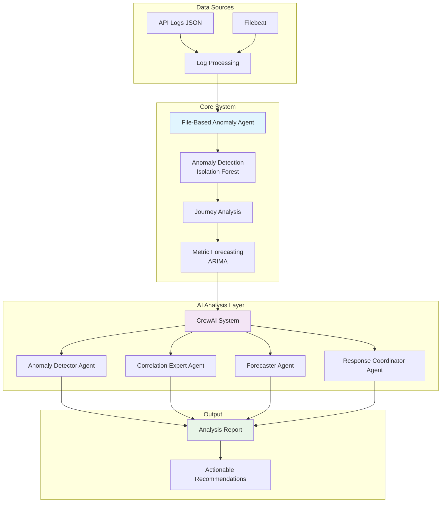
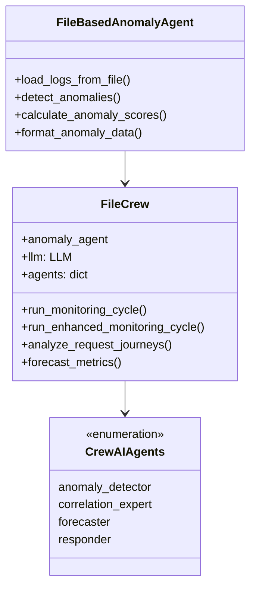
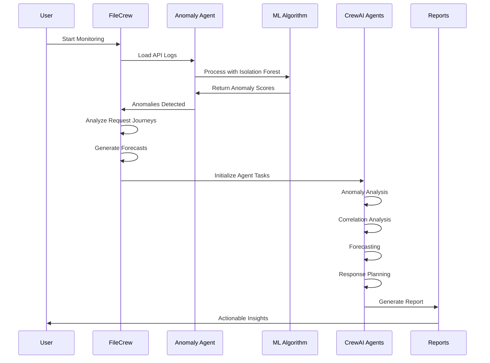
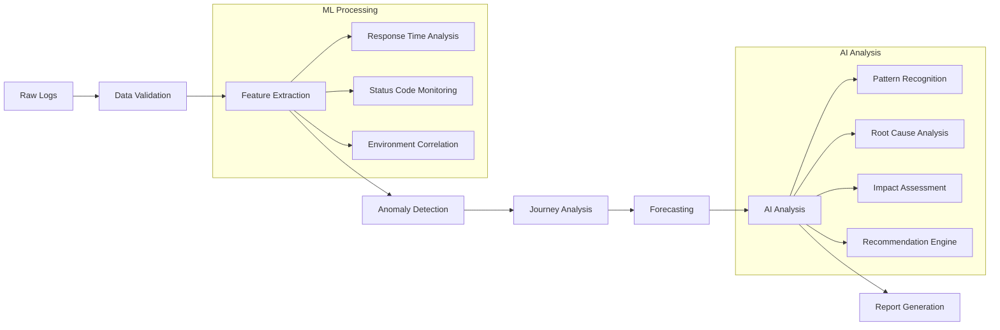

# 🔍 API Monitoring & Anomaly Detection System

A comprehensive system for monitoring API performance, detecting anomalies, and generating intelligent responses using CrewAI agents with machine learning capabilities.

## 📋 Table of Contents
- [Overview](#overview)
- [Architecture](#architecture)
- [Features](#features)
- [System Components](#system-components)
- [Workflow](#workflow)
- [Installation](#installation)
- [Usage](#usage)
- [Configuration](#configuration)
- [Data Flow](#data-flow)

## 🎯 Overview

This system provides real-time monitoring of API performance across multiple environments (cloud_a, cloud_b, hybrid, edge, on_prem) with intelligent anomaly detection and automated response recommendations using AI agents.

### Key Capabilities:
- 🚨 **Real-time Anomaly Detection** using Isolation Forest ML algorithm
- 🤖 **AI-Powered Analysis** with CrewAI multi-agent system
- 📊 **Performance Forecasting** using ARIMA time series analysis
- 🔄 **Request Journey Tracking** across distributed services
- 📈 **Visual Analytics** and reporting

## 🏗️ Architecture



## ✨ Features

### 🔍 Anomaly Detection
- **Machine Learning**: Isolation Forest algorithm for unsupervised anomaly detection
- **Multi-dimensional**: Analyzes response times, status codes, and environmental factors
- **Configurable Thresholds**: Adjustable sensitivity levels

### 🤖 AI-Powered Analysis
- **Multi-Agent System**: Specialized AI agents for different analysis tasks
- **Natural Language Processing**: Human-readable insights and recommendations
- **Context-Aware**: Understands service dependencies and business impact

### 📊 Performance Monitoring
- **Real-time Metrics**: Live monitoring of API performance
- **Trend Analysis**: Historical performance patterns
- **Forecasting**: Predictive analytics for capacity planning

## 🔧 System Components

### Core Components



### Agent Roles

| Agent | Role | Responsibility |
|-------|------|----------------|
| 🔍 **Anomaly Detector** | Detection Specialist | Identifies unusual patterns and root causes |
| 🔗 **Correlation Expert** | Journey Analyst | Tracks request flows and service dependencies |
| 📈 **Forecaster** | Predictive Analytics | Forecasts future performance and issues |
| 🚨 **Response Coordinator** | Incident Response | Generates actionable recommendations |

## 🔄 Workflow



## 📊 Data Flow

### Input Data Structure

```json
{
  "@timestamp": "2025-05-09T12:51:02.411992Z",
  "api_name": "frontend",
  "response_time": 356.51,
  "status_code": 200,
  "correlation_id": "cid-9823310f-e836-4155-a9c8-05c1dca78647",
  "environment": "cloud_a",
  "message": "API request to frontend completed in 356.51ms with status 200"
}
```

### Processing Pipeline



## 🚀 Installation

### Prerequisites
- Python 3.8+
- Required packages in `requirements.txt`

### Setup

```bash
# Clone the repository
git clone <repository-url>
cd api-monitoring-system

# Install dependencies
pip install -r requirements.txt

# Set up environment variables
cp .env.example .env
# Edit .env with your API keys
```

### Environment Variables

```bash
# .env file
GROQ_API_KEY=your_groq_api_key_here
```

## 💻 Usage

### Basic Monitoring

```python
from file_based_crew import FileCrew

# Initialize the system
crew = FileCrew()

# Run monitoring cycle
result = crew.run_monitoring_cycle('api_logs.json')
print(result)
```

### Enhanced Monitoring with Custom Data

```python
# Run with pre-analyzed data
result = crew.run_enhanced_monitoring_cycle(
    log_file='api_logs.json',
    provided_anomalies=custom_anomalies,
    provided_forecasts=custom_forecasts
)
```

### Standalone Anomaly Detection

```python
from agents.file_based_anomaly_agent import FileBasedAnomalyAgent

# Test anomaly detection independently
agent = FileBasedAnomalyAgent()
logs = agent.load_logs_from_file('api_logs.json')
anomalies, indices, scores = agent.detect_anomalies(logs, threshold=0.8)
```

## ⚙️ Configuration

### Anomaly Detection Settings

```python
# Adjustable parameters
ANOMALY_THRESHOLD = 0.8  # Sensitivity level (0.0 - 1.0)
CONTAMINATION_RATE = 0.1  # Expected anomaly percentage
N_ESTIMATORS = 100  # Isolation Forest trees
```

### AI Agent Configuration

```python
# LLM Settings
{
    "model": "groq/llama3-70b-8192",
    "temperature": 0.7,
    "stream": True
}
```

## 📈 Monitoring Metrics

### Key Performance Indicators

| Metric | Description | Normal Range |
|--------|-------------|--------------|
| Response Time | API response latency | < 500ms |
| Error Rate | HTTP 4xx/5xx responses | < 1% |
| Throughput | Requests per second | Varies by service |
| Availability | Service uptime | > 99.9% |

### Environments Monitored

- 🌐 **Cloud A**: Primary cloud environment
- 🌐 **Cloud B**: Secondary cloud environment  
- 🔄 **Hybrid**: Mixed cloud/on-premise
- 🏢 **On-Premise**: Local data center
- 🌍 **Edge**: Edge computing locations

## 📊 Sample Output

### Anomaly Detection Results

```
Found 12 anomalies from 398 logs

Top anomalies:
Anomaly 1:
  Score: 0.89
  API: payment
  Response Time: 2046.97ms
  Environment: cloud_b
  Status: 200
```

### AI Analysis Summary

```
🔍 ANOMALY ANALYSIS:
- Payment API showing 300% increase in response times
- Correlation with database connection pool exhaustion
- Affecting cloud_b environment specifically

📈 FORECAST:
- Expected 15% degradation in next hour
- High risk: payment, checkout APIs
- Medium risk: frontend API

🚨 RECOMMENDATIONS:
1. Scale database connections in cloud_b
2. Implement circuit breaker for payment API
3. Monitor memory usage on payment service pods
```

## 🔧 File Structure

```
├── 📁 agents/
│   └── file_based_anomaly_agent.py    # ML-based anomaly detection
├── file_based_crew.py                 # Main CrewAI orchestration
├── run_file_crew.py                   # Execution script
├── api_logs.json                      # Sample log data
├── filebeat.yml                       # Log shipping configuration
└── README.md                          # This file
```

## 🤝 Contributing

1. Fork the repository
2. Create a feature branch
3. Make your changes
4. Add tests if applicable
5. Submit a pull request

## 📄 License

This project is licensed under the MIT License - see the LICENSE file for details.

## 🆘 Support

For issues and questions:
- 📧 Create an issue in the repository
- 📚 Check the documentation
- 💬 Join our community discussions

---

**Built with ❤️ using CrewAI, Scikit-learn, and modern ML practices**